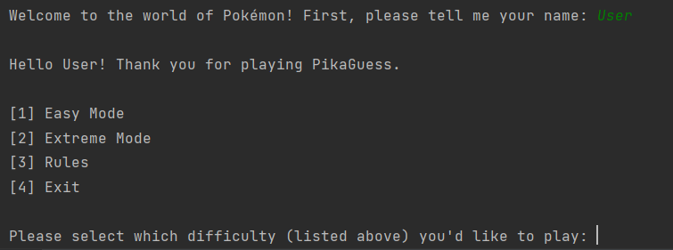
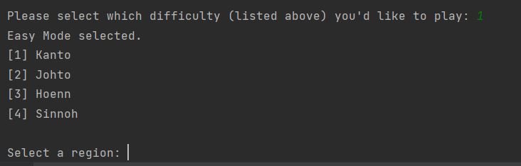
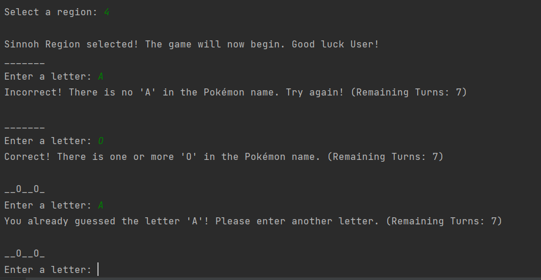
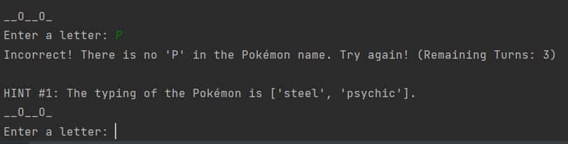

# PikaGuess

PikaGuess is a simple hangman game implemented in Python. Based on the popular video game series Pokémon, PikaGuess obtains Pokémon data (ex. name, abilities, typing, region) from text files (located in "assets" folder) and the [pypokedex library](https://github.com/arnavb/pypokedex). 

### Game Rules
This game randomly selects from a database of over 450+ Pokémon, in which the user must guess the name of the selected Pokémon in a limited number of attempts. The user will receive a certain number of allowed attempts (depending on difficulty) to guess the name of that Pokémon. 

 
 
 

Once a certain number of attempts have passed and the user has not completed the puzzle, the program will begin to provide hints to better identify the selected Pokémon. Hints include the regional origin of the Pokémon (ex. [Pikachu](https://bulbapedia.bulbagarden.net/wiki/Pikachu_(Pok%C3%A9mon)) is from the Kanto region), or the Pokémon's typing (ex. Pikachu is an Electric-type). 

If the player completes the puzzle within the allotted number of attempts, the player will begin a streak. The streak is incremented by 1 everytime the player successfully completes a puzzle. However, if the player fails a puzzle, their streak will reset. The goal is to obtain the highest number of streaks possible within a single run. 

